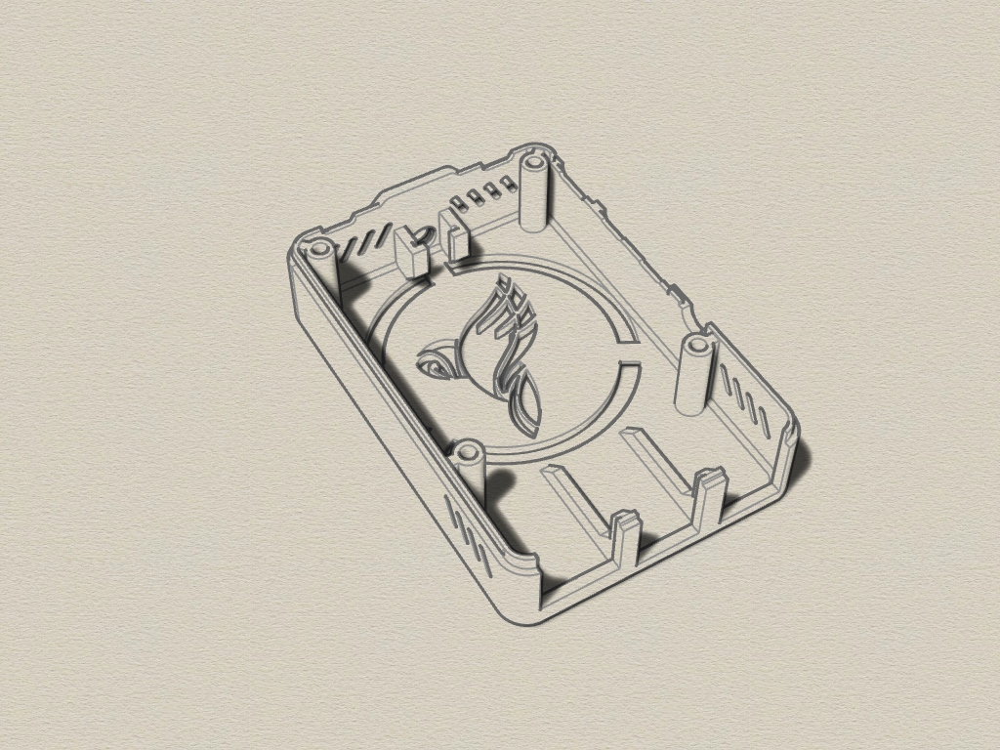

# nymea RPi4 enclosure
3D printable case for Raspberry 4 with nymea logo, created with Rhino 6.
This enclosure is orginally from thingiverse, thing 3724434. 
I only added the logo to the top side and the text to the bottom side.

## 3D Case

The enclosure consists of 2 parts which are clamped together (no screws). 

Requirements:
* 3D printer 
* Filament of your choice

## View

