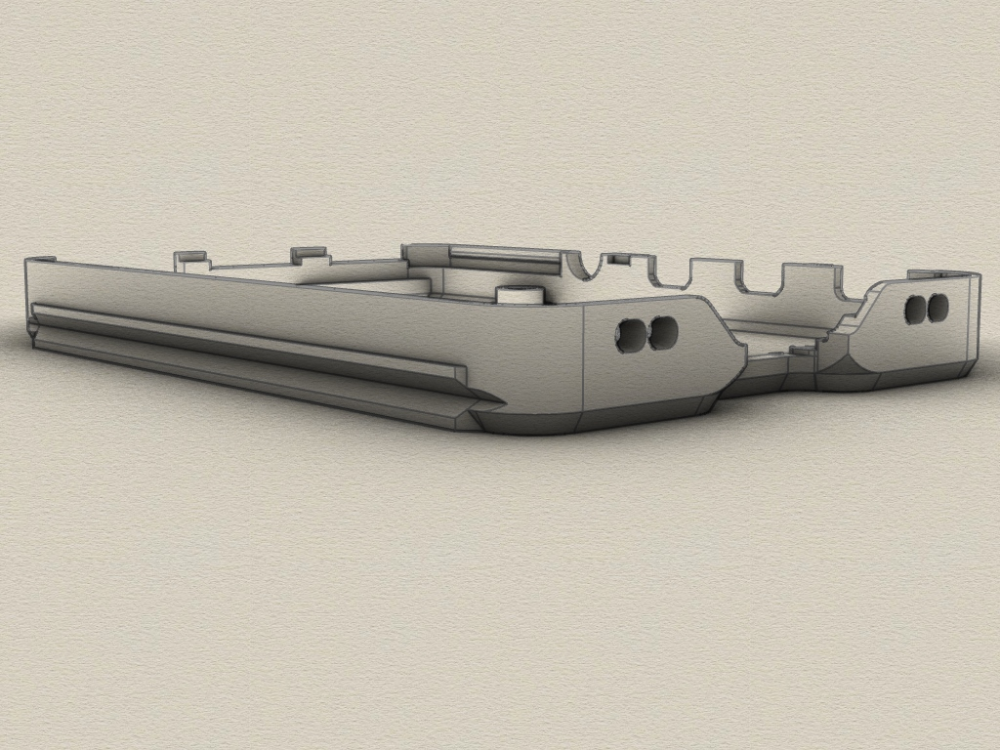

# nymea RPi4 enclosure
3D printable case for Raspberry 4 with nymea logo, created with Rhino 6.
This enclosure is orginally from thingiverse, thing 3724434. 
I only added the logo to the top side and the text to the bottom side.

#### 3D Case

The enclosure consists of 2 parts which are clamped together (no screws). 

Requirements:
* 3D printer 
* Filament of your choice

#### View

#### Added case for wallmount and TV-mount

I added a bottom case with mounttracks on each side and a wallmount + TV-mount. 
You can slide the bottom case into the wall- and TV-mount. 
You can screw the RPi4 PCB to the bottom case using M3 screws and nuts.

